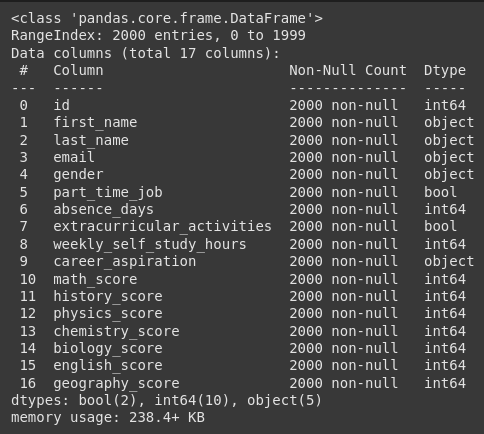
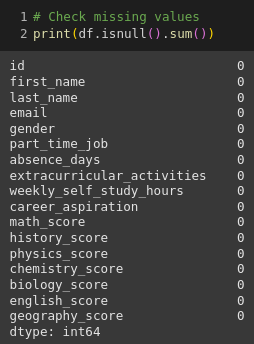
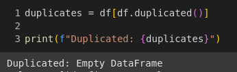
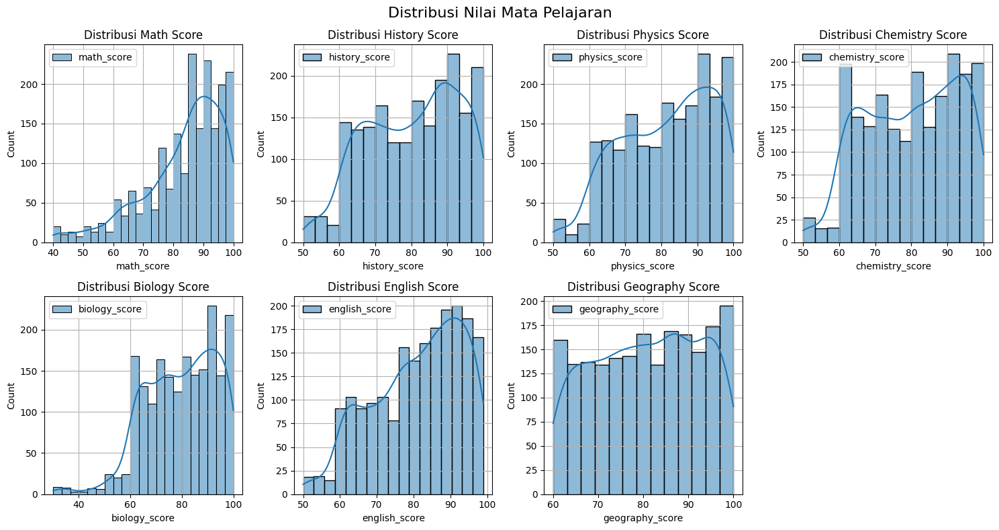
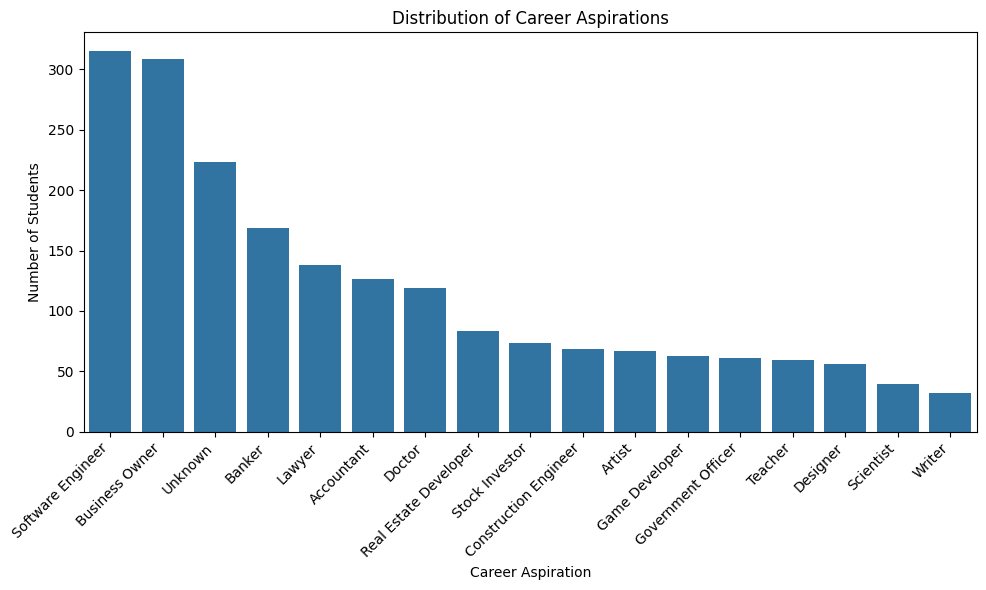
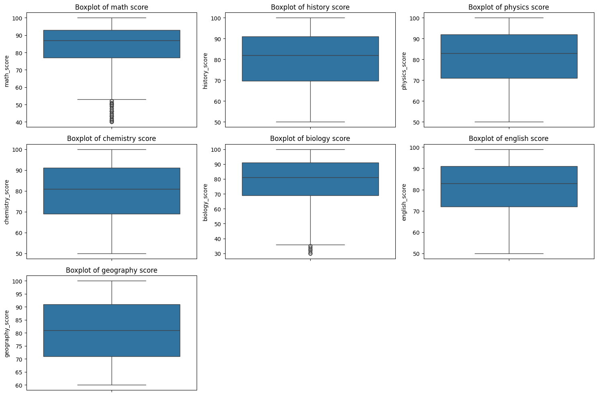
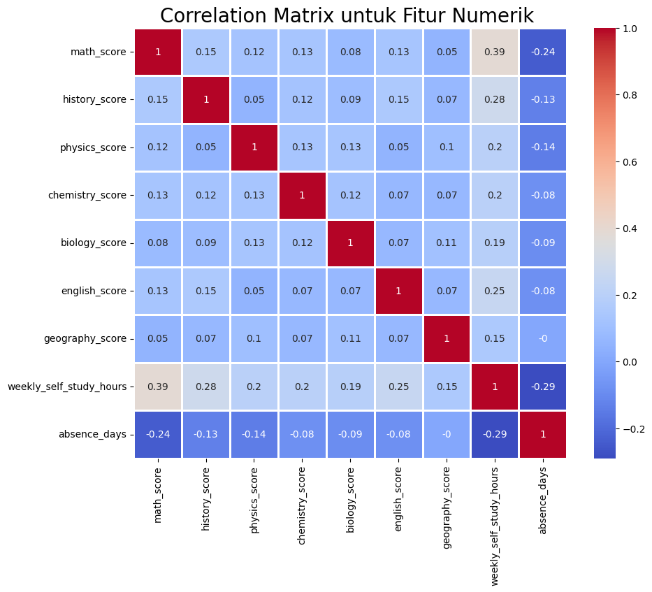
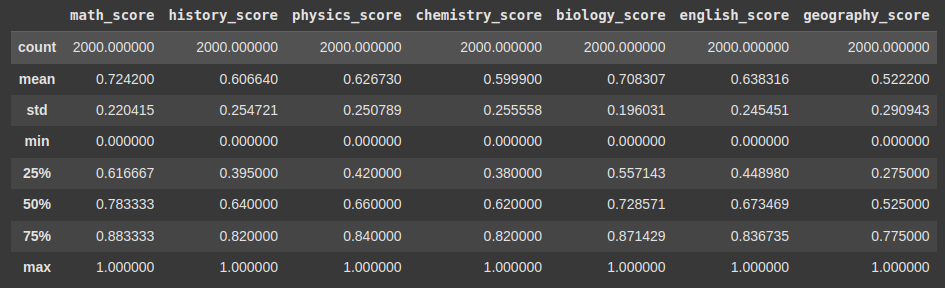
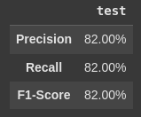

# Laporan Proyek Sistem Rekomendasi Mata Pelajaran - Akhmad Ardiansyah Amnur

## Project Overview

Dalam era globalisasi dan perkembangan teknologi yang pesat, siswa dihadapkan pada pilihan mata pelajaran yang semakin beragam dan kompleks. Pemilihan mata pelajaran yang tepat merupakan langkah penting dalam menentukan jalur pendidikan dan karir siswa di masa depan. Namun, proses pemilihan ini seringkali menjadi tantangan bagi siswa, terutama mereka yang belum memiliki pemahaman yang mendalam mengenai minat, bakat, dan potensi diri.

Kurangnya informasi dan pemahaman mengenai berbagai pilihan mata pelajaran dapat menyebabkan siswa merasa bingung dan kesulitan dalam mengambil keputusan. Akibatnya, siswa mungkin memilih mata pelajaran yang kurang sesuai dengan minat dan bakat mereka, yang dapat berdampak pada motivasi belajar, prestasi akademik, dan bahkan pilihan karir di masa depan.

Untuk mengatasi permasalahan ini, diperlukan sebuah sistem yang dapat membantu siswa dalam memilih mata pelajaran yang paling sesuai dengan minat, bakat, dan potensi mereka. Sistem rekomendasi mata pelajaran hadir sebagai solusi untuk menjawab kebutuhan ini.

**Mengapa Proyek Ini Penting untuk Diselesaikan?**

Proyek sistem rekomendasi mata pelajaran memiliki beberapa justifikasi yang membuatnya penting untuk diselesaikan:

1. **Personalisasi Pembelajaran**: Setiap siswa memiliki karakteristik, minat, dan bakat yang unik. Sistem rekomendasi memungkinkan personalisasi pembelajaran yang lebih baik dengan menyesuaikan rekomendasi mata pelajaran dengan kebutuhan dan preferensi individu siswa. Hal ini dapat meningkatkan motivasi, keterlibatan, dan hasil belajar siswa secara keseluruhan.

2. **Peningkatan Efisiensi**: Proses pemilihan mata pelajaran secara manual dapat memakan waktu dan tenaga. Sistem rekomendasi dapat menyederhanakan proses ini dengan memberikan informasi yang relevan dan akurat kepada siswa, sehingga mereka dapat membuat keputusan yang lebih cepat dan tepat.

3. **Peningkatan Kepuasan Siswa**: Ketika siswa memilih mata pelajaran yang sesuai dengan minat dan bakat mereka, mereka cenderung lebih termotivasi dan puas dengan pengalaman belajar mereka. Hal ini dapat berdampak positif pada prestasi akademik dan perkembangan pribadi siswa.

4. **Dukungan Pengambilan Keputusan**: Sistem rekomendasi menyediakan informasi yang komprehensif dan mudah diakses, membantu siswa (dan orang tua mereka) dalam membuat keputusan yang lebih baik mengenai pilihan mata pelajaran.

5. **Relevansi dengan Kebutuhan Industri**: Sistem rekomendasi dapat dirancang untuk mempertimbangkan kebutuhan industri dan pasar kerja saat ini. Dengan demikian, siswa dapat memilih mata pelajaran yang tidak hanya menarik bagi mereka, tetapi juga relevan dengan prospek karir mereka di masa depan.

6. **Mengatasi Keterbatasan Informasi**: Seringkali siswa memiliki keterbatasan informasi mengenai berbagai pilihan mata pelajaran dan dampaknya terhadap jalur karir mereka. Sistem rekomendasi membantu mengatasi keterbatasan ini dengan menyediakan informasi yang terstruktur dan mudah dipahami.

7. **Peningkatan Efisiensi Penggunaan Sumber Daya**: Dengan membantu siswa memilih mata pelajaran yang tepat sejak awal, sistem rekomendasi dapat mengurangi kemungkinan siswa untuk berganti jurusan atau mengulang mata pelajaran di kemudian hari. Hal ini dapat menghemat waktu, biaya, dan sumber daya pendidikan.

Dengan berbagai justifikasi ini, proyek sistem rekomendasi mata pelajaran memiliki potensi besar untuk meningkatkan kualitas pendidikan dan membantu siswa mencapai potensi maksimal mereka.

Refrensi:

- [Sistem Rekomendasi Nilai Mata Kuliah Menggunakan Metode Content-Based Filtering](http://www.jurnal.upnyk.ac.id/index.php/semnasif/article/view/1148) 

## Business Understanding

Proyek sistem rekomendasi mata pelajaran ini bertujuan untuk mengatasi permasalahan siswa dalam memilih mata pelajaran yang sesuai dengan minat, bakat, dan tujuan karir mereka. Kurangnya informasi dan pemahaman yang mendalam mengenai berbagai pilihan mata pelajaran, prospek karir, serta keterbatasan waktu dan sumber daya menjadi kendala utama dalam proses pengambilan keputusan. Hal ini dapat berdampak pada kualitas pendidikan secara keseluruhan, kurangnya relevansi antara pendidikan dan kebutuhan pasar kerja, serta potensi siswa yang tidak berkembang secara optimal. Oleh karena itu, diperlukan sebuah solusi yang dapat membantu siswa dalam memilih mata pelajaran yang paling sesuai dengan potensi dan minat mereka, sehingga dapat meningkatkan motivasi belajar, prestasi akademik, dan pada akhirnya, peluang karir di masa depan. Sistem rekomendasi mata pelajaran hadir sebagai solusi untuk menjawab kebutuhan ini, dengan memanfaatkan data dan teknologi untuk memberikan rekomendasi yang dipersonalisasi berdasarkan berbagai faktor, termasuk nilai mata pelajaran, waktu belajar dalam sepekan, ketidakhadiran dan aspirasi karir.

### Problem Statements

Pernyataan masalah dalam proyek ini mengidentifikasi kesenjangan atau tantangan yang perlu diatasi oleh sistem rekomendasi mata pelajaran.

1. Siswa kesulitan memilih mata pelajaran yang sesuai dengan minat, bakat, dan tujuan karir mereka karena kurangnya informasi dan pemahaman yang mendalam mengenai berbagai pilihan mata pelajaran.

2. Proses pemilihan mata pelajaran seringkali memakan waktu dan tenaga, baik bagi siswa maupun guru.

3. Kurikulum yang ada belum secara optimal memfasilitasi personalisasi pembelajaran berdasarkan preferensi individu siswa.

### Goals

Tujuan proyek ini adalah untuk memberikan solusi terhadap pernyataan masalah yang telah diidentifikasi.

1. Mengembangkan sistem rekomendasi berbasis konten yang menyediakan informasi komprehensif dan mudah diakses mengenai berbagai pilihan mata pelajaran, termasuk deskripsi mata pelajaran, waktu belajar dalam sepekan, kehadiran di kelas, dan aspirasi karir siswa.

2. Membangun sistem rekomendasi yang efisien dan efektif, sehingga mempermudah dan mempercepat proses pemilihan mata pelajaran bagi siswa dan guru.

3. Membuat sistem rekomendasi yang mampu menyesuaikan rekomendasi mata pelajaran dengan kebutuhan dan preferensi individu siswa, sehingga mendukung personalisasi pembelajaran.

### Solution statements
Untuk mencapai tujuan-tujuan tersebut, berikut adalah pendekatan solusi yang dapat dipertimbangkan:

- **Sistem Rekomendasi Berbasis Konten (Content-Based Filtering)**:
    Pendekatan ini merekomendasikan mata pelajaran berdasarkan mata pelajaran, waktu belajar dalam sepekan, kehadiran di kelas, dan aspirasi karir siswa. Sistem akan mencari kecocokan antara konten mata pelajaran dengan profil siswa untuk memberikan rekomendasi yang relevan.

## Data Understanding
[Dataset Student Studeis Recommendation](https://www.kaggle.com/datasets/noorsaeed/student-studeis-recommendation) yang digunakan dalam proyek ini adalah kumpulan data yang berisi informasi tentang siswa yang terdaftar di suatu akademi, termasuk rincian pribadi, nilai akademik, kegiatan ekstrakurikuler, dan aspirasi karier.

Variabel-variabel pada [Dataset Student Studeis Recommendation](https://www.kaggle.com/datasets/noorsaeed/student-studeis-recommendation) adalah sebagai berikut:

1. id: ID unik untuk setiap siswa.
2. first_name: Nama depan siswa.
3. last_name: Nama belakang siswa.
4. email: Email siswa.
5. gender: Jenis kelamin siswa (male/female).
6. part_time_job: Menunjukkan apakah siswa memiliki pekerjaan paruh waktu (True/False).
7. absence_days: Jumlah hari siswa tidak hadir.
8. extracurricular_activities: Menunjukkan apakah siswa berpartisipasi dalam kegiatan ekstrakurikuler (True/False).
9. weekly_self_study_hours: Jumlah jam yang dihabiskan siswa untuk belajar mandiri per pekan.
10. career_aspiration: Jalur karier yang diharapkan dari siswa.
11. math_score: Skor yang dicapai siswa dalam matematika.
12. history_score:  Skor yang dicapai siswa dalam sejarah.
13. physics_score:  Skor yang dicapai siswa dalam fisika.
14. chemistry_score:  Skor yang dicapai siswa dalam kimia.
15. biology_score:  Skor yang dicapai siswa dalam biologi.
16. english_score:  Skor yang dicapai siswa dalam bahasa inggris.
17. geography_score:  Skor yang dicapai siswa dalam geografi.

### Jumlah data  
- Jumlah row pada dataset sebanyak 2000 rows
- Jumlah kolom(variabel) pada dataset sebanyak 17 kolom

### Kondisi Data
- Tipe data: Berikut tipe data pada variabel-variabel dataset
    - String: first_name, last_name, email, gender, dan career_aspiration.
    - Boolean: part_time_job dan extracurriculer_activities.
    - Integer: absence_days, weekly_self_study_hours, math_score, history_score, physics_score, chemistry_score, biology_score,english_score, dan geography_score.
    
- Tidak ada missing value
        
    

- Tidak ada duplikat

    

### Exploratory Data Analysis

- Distribusi nilai mata pelajaran:
    
    

    Insight: 

    - **Perbedaan Distribusi**: Setiap mata pelajaran memiliki distribusi nilai yang berbeda. Ada mata pelajaran yang nilai siswanya cenderung lebih tinggi (terlihat dari puncak kurva yang lebih condong ke kanan), dan ada pula yang lebih rendah. Ini mengindikasikan tingkat kesulitan atau minat siswa yang berbeda terhadap masing-masing mata pelajaran.

    - **Kinerja Siswa**: Secara sekilas bagaimana kinerja siswa secara keseluruhan pada setiap mata pelajaran. Misalnya, jika ada banyak siswa yang mendapatkan nilai di bawah rata-rata pada suatu mata pelajaran, maka perlu dilakukan evaluasi lebih lanjut terkait materi, metode pengajaran, atau faktor lain yang mungkin mempengaruhi.

    - **Outlier**: Ada beberapa nilai yang terlihat jauh dari kelompok data lainnya (outlier). Ini bisa menjadi indikasi adanya kemungkinan faktor khusus yang mempengaruhi nilai siswa tersebut.

    - **Kemungkinan Distribusi Normal**: Beberapa distribusi nilai terlihat mendekati distribusi normal (bentuk kurva lonceng), namun ada juga yang tidak. Ini bisa menjadi acuan untuk memilih metode statistik yang tepat dalam analisis lebih lanjut.

- Distribusi aspirasi karir

    

    Insight:
    - **Pilihan Karir Populer**: Aspirasi karir yang paling populer di antara siswa adalah menjadi seorang Software Engineer. Hal ini menunjukkan minat yang tinggi terhadap bidang teknologi dan pemrograman.

    - **Minat Bisnis**: Pilihan karir sebagai Business Owner juga cukup tinggi, menunjukkan minat siswa untuk memulai bisnis sendiri atau menjadi seorang pengusaha.

    - **Profesi Tradisional**: Profesi-profesi tradisional seperti Lawyer, Doctor, dan Teacher masih menjadi pilihan yang cukup populer.

    - **Pilihan Karir yang Lebih Spesifik**: Selain profesi-profesi umum, visualisasi ini juga menunjukkan adanya minat pada profesi yang lebih spesifik seperti Game Developer, Stock Investor, dan Real Estate Developer.

    - **Jumlah Siswa yang Belum Tahu**: Ada sejumlah siswa yang belum memiliki aspirasi karir yang jelas (terlihat pada kategori "Unknown").

- Boxplot setiap mata pelajaran:

    

    Insight:
    - **Kuartil**: Garis tengah kotak mewakili median (nilai tengah). Batas bawah kotak menunjukkan kuartil pertama (25% data di bawah nilai ini), dan batas atas kotak menunjukkan kuartil ketiga (75% data di bawah nilai ini). Jarak antara kuartil pertama dan ketiga disebut rentang interkuartil (IQR), yang memberikan gambaran tentang sebaran nilai di tengah-tengah data.

    - **Jangkauan**: Garis-garis yang memanjang dari kotak (whisker) menunjukkan jangkauan data yang masih dianggap wajar. Data yang berada di luar jangkauan ini dianggap sebagai outlier.

    - **Outlier**: Titik-titik yang berada di luar whisker adalah outlier, yaitu nilai yang jauh berbeda dari data lainnya.

- Korelasi fitur tipe data numerik

    

    Insight:
    - **Korelasi positif antara jam belajar mandiri dan skor mata pelajaran**:

    `Weekly_self_study_hours` memiliki korelasi positif dengan `math_score` (0.39), `history_score` (0.28), dan mata pelajaran lainnya, menunjukkan bahwa semakin sering siswa belajar mandiri, semakin tinggi nilai mereka.

    - **Korelasi negatif antara ketidakhadiran dan skor mata pelajaran**:

    `absence_days` memiliki korelasi negatif dengan hampir semua skor mata pelajaran (terutama `math_score` -0.24 dan `weekly_self_study_hours` -0.29). Ini menunjukkan bahwa semakin sering siswa absen, semakin rendah nilai mereka.

    - **Korelasi antar mata pelajaran relatif rendah**:

    Tidak ada korelasi yang sangat kuat antara satu mata pelajaran dengan lainnya, menunjukkan bahwa performa siswa dalam satu subjek tidak selalu mencerminkan performa di subjek lain.

## Data Preparation

- **Normaslisasi nilai mata pelajaran**:
    Menormalisasi nilai-nilai numerik pada kolom-kolom tertentu dalam sebuah DataFrame menggunakan metode Min-Max Scaler. Normalisasi ini akan mengubah nilai-nilai menjadi rentang antara 0 dan 1, sehingga semua fitur memiliki skala yang sama.

    

- **TF-IDF Vektorisasi**:
    Melakukan proses vektorisasi TF-IDF pada kolom 'career_aspiration' dari sebuah DataFrame.

- **Gabungkan semua fitur**:
    Menggabungkan berbagai jenis fitur untuk membangun matriks fitur yang dapat digunakan dalam model

- **Train-Test-Split**:
    Melakukan pembagian data menjadi data latih (train data) dan data uji (test data). Data latih digunakan untuk melatih model, sedangkan data uji digunakan untuk mengevaluasi kinerja model pada data yang belum pernah dilihat sebelumnya.

## Modeling
Dengan menggunakan pendekatan berbasis kesamaan (similarity-based) dengan metode cosine similarity. Berikut adalah langkah-langkah utama dalam sistem ini:

1. **Preprocessing Input**
    - **Normalisasi Skor Mata Pelajaran**  
    Skor mata pelajaran dari siswa dinormalisasi menggunakan `scaler.transform()` agar berada dalam skala yang sama.
    - **TF-IDF untuk Career Aspiration**  
    Preferensi karier siswa dikonversi ke dalam vektor numerik menggunakan metode TF-IDF.
    - **Penyesuaian Weekly Study dan Absence**  
        - `study_adjustment` dihitung dengan membagi jumlah jam belajar per minggu dengan 50.
        - `absence_penalty` dihitung sebagai `1 - (jumlah hari absen / 10)`, yang mengurangi skor jika siswa sering absen.

2. **Penggabungan Semua Fitur Input**
    - Semua fitur (skor mata pelajaran, aspirasi karier, jam belajar, dan jumlah absensi) dikombinasikan menjadi satu vektor menggunakan `np.concatenate()`, lalu diubah menjadi bentuk `(1, -1)` agar kompatibel dengan perhitungan similarity.

3. **Menghitung Similarity dengan Seluruh Siswa**
    - Menggunakan cosine similarity, input siswa dibandingkan dengan data siswa lain (`train_data`) untuk mencari siswa yang paling mirip.

4. **Memilih Siswa Teratas Berdasarkan Similarity**
    - Hasil cosine similarity diurutkan dari yang paling mirip hingga paling tidak mirip.
    - Diambil **n siswa teratas** (default: 3 siswa) sebagai referensi.

5. **Menghitung Rata-rata Skor Mata Pelajaran dari Siswa Teratas**
    - Skor mata pelajaran dari siswa yang dipilih dihitung rata-ratanya.
    - Hasilnya diurutkan secara menurun (`sort_values(ascending=False)`) agar mendapatkan rekomendasi terbaik.

6. **Menghasilkan Rekomendasi Mata Pelajaran**
    - Mengambil 3 mata pelajaran teratas (`head(3)`) dari hasil perhitungan rata-rata dan mengembalikannya dalam bentuk dictionary.

Sistem ini memberikan rekomendasi mata pelajaran yang paling sesuai berdasarkan **kemiripan nilai akademik**, **aspirasi karier**, **waktu belajar dalam sepekan**, dan **ketidakhadiran di kelas**

Dengan pendekatan ini, sistem dapat membantu siswa memilih mata pelajaran yang sesuai dengan kekuatan akademik dan tujuan karier mereka.

## Evaluation
Untuk mengevaluasi performa masing-masing model menggunakan metrik Precision, Recall dan F1-Score. Berikut peran masing-masing metrik:

1. **Precision**: Metrik ini mengukur seberapa akurat rekomendasi yang diberikan oleh sistem, dengan mempertimbangkan hanya k item teratas yang direkomendasikan.

2. **Recall**: Metrik yang digunakan untuk mengukur seberapa baik sistem rekomendasi dalam menemukan semua item yang relevan bagi pengguna, dengan mempertimbangkan hanya k item teratas yang direkomendasikan.

3. **F1-Score**: Metrik yang menggabungkan precision at k dan recall at k dalam satu nilai. Metrik ini digunakan untuk mengukur keseimbangan antara akurasi dan kelengkapan rekomendasi yang diberikan oleh sistem, dengan mempertimbangkan hanya k item teratas yang direkomendasikan.

DataFrame Metrik:

- **Presisi (Precision)**: Dari semua prediksi positif yang dilakukan oleh model, 82% di antaranya benar. Dengan kata lain, ketika model memprediksi sesuatu positif, ada kemungkinan 82% bahwa itu memang positif.

- **Recall (Recall)**: Dari semua data positif yang sebenarnya, model berhasil mendeteksi 82% di antaranya. Ini berarti model cukup baik dalam menemukan sebagian besar data positif yang ada.

- **F1-Score (F1-Score)**: F1-score adalah rata-rata harmonik dari presisi dan recall. Nilai 82% menunjukkan bahwa model memiliki keseimbangan yang baik antara presisi dan recall.

Berdasarkan metrik evaluasi ini, sistem rekomendasi menunjukkan performa yang baik pada data uji dengan presisi, recall, dan F1-score sebesar 82%. Sistem rekomendasi ini memiliki kemampuan yang seimbang dalam mengidentifikasi data positif dengan benar dan menemukan sebagian besar data positif yang ada.

Model Sistem Rekomendasi Mata Pelajaran yang dikembangkan tidak hanya berfungsi sebagai alat rekomendasi, tetapi juga sebagai solusi komprehensif untuk mengatasi tantangan-tantangan utama dalam dunia pendidikan. Berikut adalah penjelasan bagaimana model ini menjawab setiap pernyataan masalah:

1. **Informasi Komprehensif dan Mudah Diakses**   
Model ini menyediakan informasi komprehensif dan mudah diakses mengenai berbagai pilihan mata pelajaran. Informasi ini membantu siswa memahami lebih baik opsi yang tersedia dan membuat keputusan yang lebih terinformasi.

2. **Efisiensi dan Efektivitas Pemilihan**   
Model ini dirancang untuk efisien dan efektif, sehingga mempermudah dan mempercepat proses pemilihan mata pelajaran bagi siswa dan guru. Dengan antarmuka yang intuitif dan rekomendasi yang relevan, siswa dapat menghemat waktu dan fokus pada hal-hal yang lebih penting.

3. **Personalisasi Pembelajaran**   
Model ini mampu menyesuaikan rekomendasi mata pelajaran dengan kebutuhan dan preferensi individu siswa, sehingga mendukung personalisasi pembelajaran. Dengan mempertimbangkan minat dan tujuan karir siswa, model ini memberikan rekomendasi yang lebih relevan dan sesuai dengan kebutuhan masing-masing siswa.

Pengembangan Model Sistem Rekomendasi Mata Pelajaran yang telah dilakukan membuahkan hasil dan sukses besar dalam mencapai goals yang telah ditetapkan. Berikut adalah bagaimana model ini berhasil mewujudkan masing-masing goals:

1. **Informasi Mata Pelajaran Lengkap & Mudah Diakses**   
Model ini berhasil menyediakan platform yang mudah diakses bagi siswa untuk mencari informasi lengkap mengenai mata pelajaran yang tersedia. Informasi yang disajikan mencakup mata pelajaran, perkiraan waktu belajar yang dibutuhkan dalam sepekan, tingkat kehadiran yang ideal di kelas, dan bagaimana keterkaitan mata pelajaran tersebut dengan berbagai aspirasi karir yang mungkin diminati siswa. Dengan demikian, siswa mendapatkan gambaran yang jelas dan komprehensif sebelum menentukan pilihan.

2. **Proses Pemilihan Efisien & Cepat**   
Model ini telah dirancang untuk memiliki alur yang efisien. Proses rekomendasi dapat dilakukan dengan cepat, sehingga siswa dan guru dapat menghemat waktu mereka yang berharga. Efisiensi ini juga mengurangi potensi kesalahan atau ketidakpastian dalam proses pemilihan mata pelajaran.

3. **Rekomendasi yang Dipersonalisasi**   
Model ini tidak hanya memberikan informasi, tetapi juga mampu memberikan rekomendasi yang dipersonalisasi. Dengan mempertimbangkan nilai dan aspirasi karir siswa, sistem ini mampu menghasilkan daftar mata pelajaran yang paling sesuai untuk setiap individu. Hal ini memungkinkan siswa untuk belajar sesuai dengan gaya dan kecepatan mereka masing-masing, yang pada akhirnya mendukung personalisasi pembelajaran yang lebih efektif.